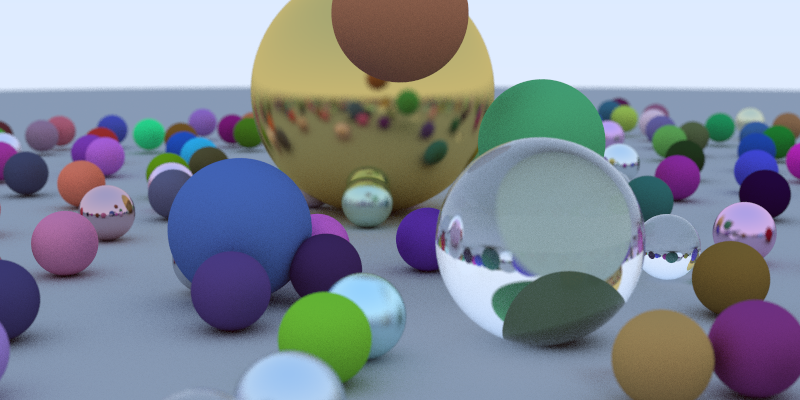

# raytracing
A simple ray tracer

[](https://travis-ci.com/mehrmann/raytracing)




## Building on Linux
###Install dependencies
```
sudo apt install build-essentials cmake
sudo apt install libfltk1.3-dev fluid
sudo apt install freeglut3 freeglut3-dev libglew1.5 libglew1.5-dev libglu1-mesa libglu1-mesa-dev libgl1-mesa-glx libgl1-mesa-dev
```

###Build
```
mkdir build
cd build
cmake ..
make
```

###Run
```
./raytracing
```
